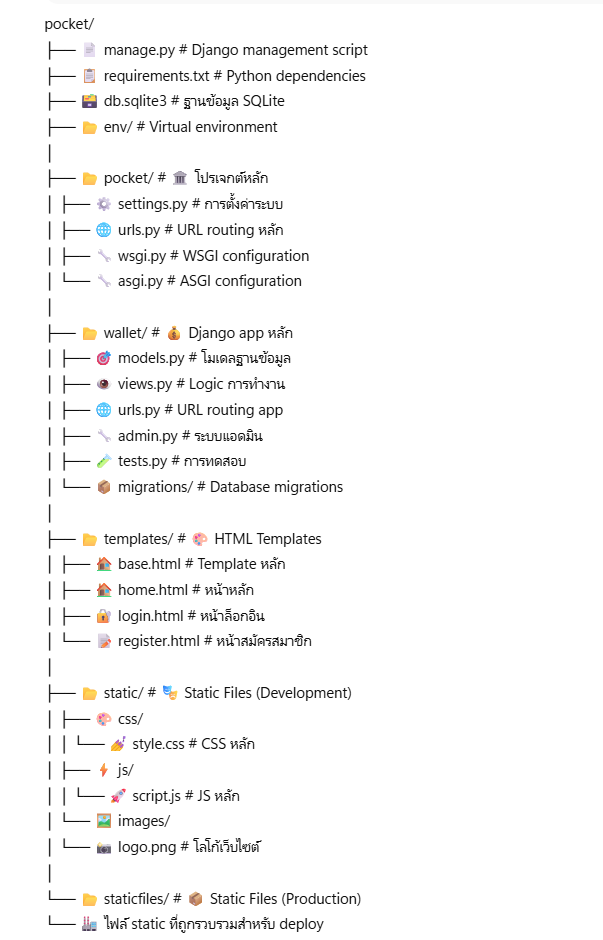

# 💸 Pocket - ระบบจัดการรายรับรายจ่าย

Pocket เป็นเว็บแอปพลิเคชัน **Django** สำหรับจัดการระบบ Wallet และผู้ใช้  
สามารถบันทึกรายรับ–รายจ่าย ดูยอดรวม และจัดการข้อมูลผ่าน Django Admin

---

## 👥 สมาชิกกลุ่ม
1. นายนนทพัทธ์ นะทีศรี (6712732108)  
2. นายวทัญญู ช่างเกวียน (6712732117)  
3. นายนิลรักษ์ บุตรโพธิ์ศรี (6712732130)  
4. นางสาวจีรนันท์ เกิดกล้า (6712732121)  

---

## 📁 โครงสร้างโปรเจกต์

## 🌐 โครงสร้างเว็บไซต์
- **หน้า Home (`home.html`)** : แสดงรายการธุรกรรม, ยอดเงิน, เพิ่ม/ลบธุรกรรม  
- **หน้า Login (`login.html`)** : สำหรับเข้าสู่ระบบผู้ใช้  
- **หน้า Register (`register.html`)** : สำหรับสมัครสมาชิกใหม่  
- **Template หลัก (`base.html`)** : โครงสร้างพื้นฐานของทุกหน้า  
- **Static Files** : CSS, JS, รูปภาพ สำหรับตกแต่งหน้าเว็บ  

---

## 🚀 ฟีเจอร์หลัก
- ✅ สมัครสมาชิก / ล็อกอิน / ล็อกเอาต์  
- ✅ เพิ่มธุรกรรม (รายรับ/รายจ่าย)  
- ✅ ลบธุรกรรม  
- ✅ แสดงยอดเงินรวม, รายรับ, รายจ่าย  
- ✅ Django Admin สำหรับจัดการข้อมูล  

---

## 🗃️ โครงสร้างฐานข้อมูล
**Transaction**  
- `user` → ผู้ใช้ที่สร้างธุรกรรม (ForeignKey)  
- `name` → ชื่อธุรกรรม  
- `description` → รายละเอียด  
- `amount` → จำนวนเงิน  
- `transaction_type` → ประเภท (1 = รายรับ, -1 = รายจ่าย)  
- `created_at`, `updated_at` → เวลาสร้าง/แก้ไข  

---

## 🔀 URL Routing
- `/` → หน้า Home (`wallet.views.home`)  
- `/login/` → หน้า Login (`wallet.views.login_view`)  
- `/register/` → หน้า Register (`wallet.views.register_view`)  
- `/delete_transaction/<id>/` → ลบธุรกรรม  
- `/logout/` → ออกจากระบบ  
